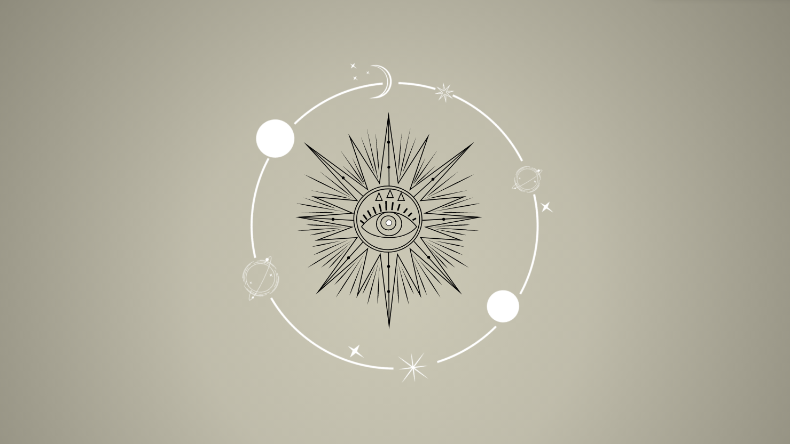
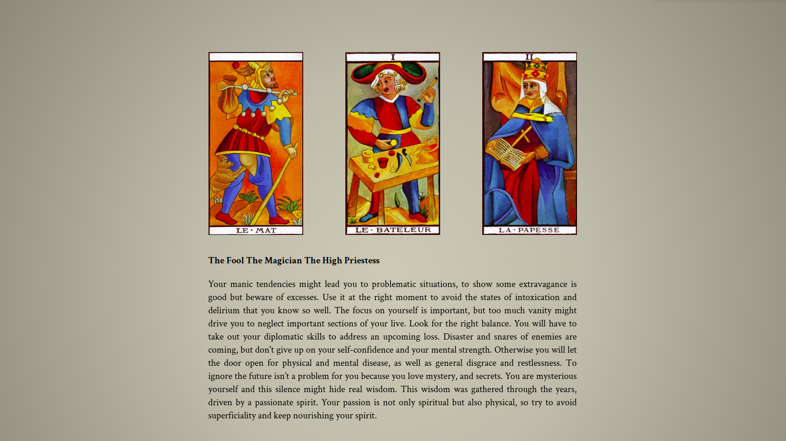

# TAROT READING APP TO GO

####  Structure:

```
Project
│   README.md
│   package.json
|   package-lock.json
└───src
│   │   index.html
│   └───styles
|   └───scss
|   │    └───main
│   │    └───abstracts
│   │    └───base
│   │    └───pages
│   └───scripts
│   │     └───data
│   │     └───index.js
|   └───img
└───dist
```

```

Task management
│
│
|
└───Romain-Kevin-Gabriela
│   │
│   └───javaScript
|           └───import from database
|           └───generate list of cards
|           └───when click display infos
|
└───Gabriela
│   │
│   └───more javaScript
|           └───delay
|           └───random cards
|           └───only 3 cards
└───Romain
|    │
|    └───Layout
│             └───intro
|             └───card selection
|             └───card info
|
└───Kevin
     └───Animation
     └───Responsive

```

#### PROJECT INTERFACE

##### first page: intro



##### second page: card choice


##### third page: result, card reading



#### SPECIAL FEATURES

we used the Fisher Yates algorithm to shuffle the cards and applied it to our code:

(Fisher Yates Shuffle Wikipedia) [https://en.wikipedia.org/wiki/Fisher%E2%80%93Yates_shuffle]

```
function shuffle(arr) {
  for (let i = arr.length - 1; i > 0; i--) {
    let j = Math.floor(Math.random() * (i + 1));
    [arr[i], arr[j]] = [arr[j], arr[i]];
  }
```

#### EXTERNAL TOOLS

we used animista for the animations

(animista) [https://animista.net/]
